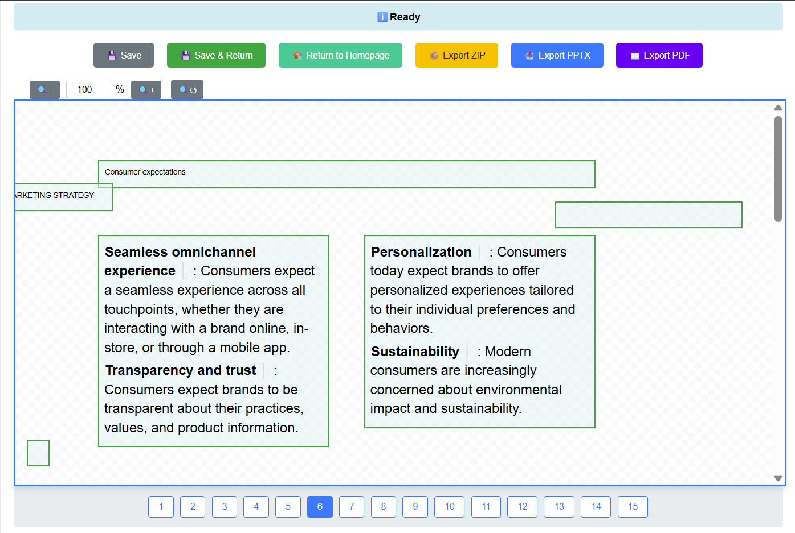
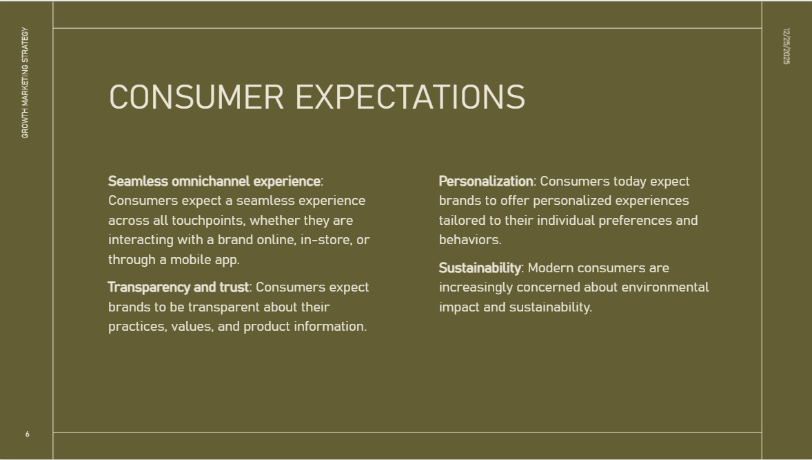
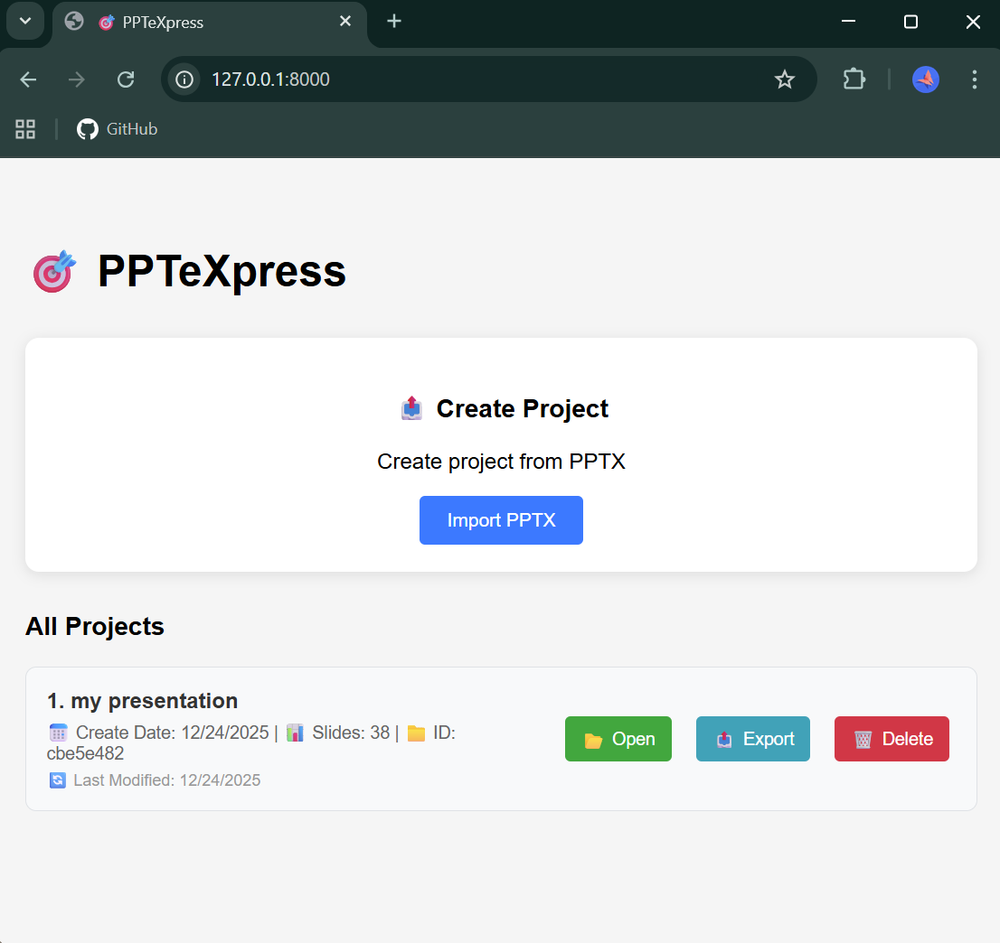
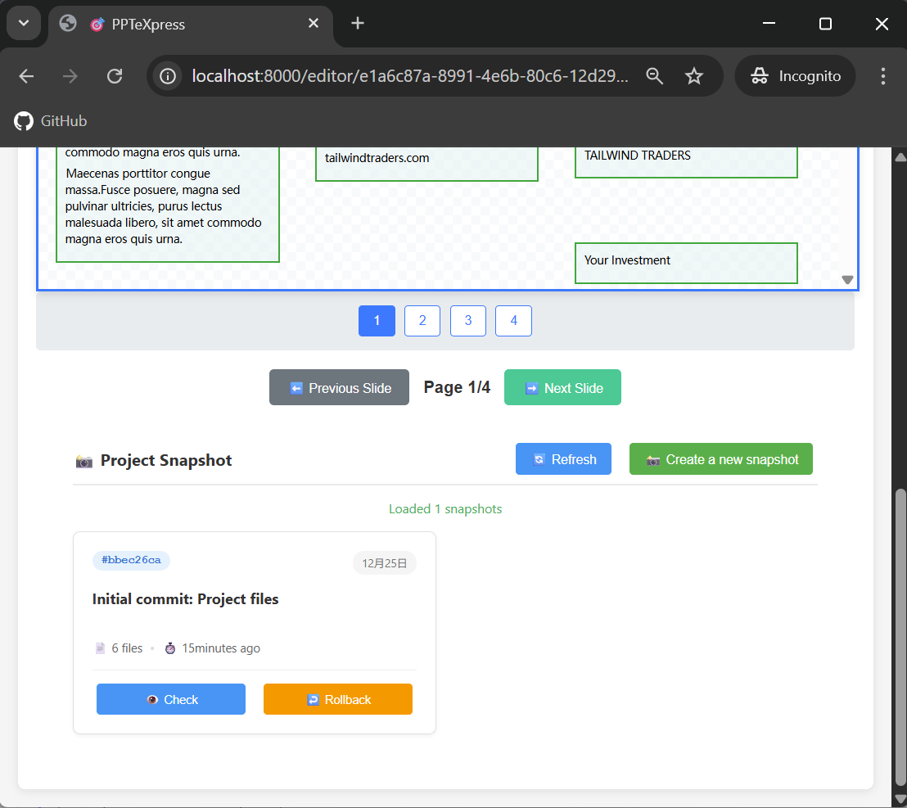

# PPTeXpress ✨

A lightweight web-based *PPTX editor* built with [FastAPI](https://fastapi.tiangolo.com/) and [python-pptx](https://python-pptx.readthedocs.io/en/latest/), designed for painless template filling and format-preserving editing. **Runs entirely on your local machine — your data never leaves.**

> 🧩 Edit your slides like filling out a form, then export it preserving all original formatting. No MS Office or LibreOffice required — ever again.

| Editor View | Exported Slide |
|-------------|----------------|
|  |  |

*Left: PPTeXpress editing interface. Right: Exported slide (example from [Microsoft PowerPoint Templates](https://powerpoint.cloud.microsoft/)).*

---

## 🚀 Why PPTeXpress?

Tired of expensive licenses, bloated office suites, and format-breaking cross-platform edits?  
PPTeXpress is a **geek-friendly, local-first** alternative for those who:

- 🧑‍💻 **Occasionally need to update slides** without installing heavyweight office software
- 🌱 **Value open-source philosophy** and prefer lightweight, modular tools
- 🕵️ **Enjoy clever, unconventional projects** that solve real-world friction
- 🔄 **Want version-controlled presentations** with Git-like snapshots and rollbacks
- 🧠 **Appreciate tools that reflect thoughtful engineering** and developer ethos

This isn’t meant to replace PowerPoint for power users.  
It’s for **lightweight editing, template-based workflows, and version-aware collaboration** — all through your browser, entirely offline.

---

## ✨ Features

### 🖥️ Web-Based & Visual
- Edit PPTX files directly in your browser — no desktop office suite needed
- Clean, intuitive UI with visual element highlighting
- Support edition of **texts**, **tables**, and **images**
- Near-WYSIWYG editing experience (the editor shows a different layout from the real slide)


### 🔒 Format-Safe Editing
- Edit text and replace images **without breaking original layouts, fonts, or styles**
- Green boxes = editable text | Blue boxes = tables | Images = substitutable
- *Export to PPTX/PDF* with **fully preserved formats**
- *Export as ZIP* for clean meta data

### 🗂️ Git-Style Version Control
- Take snapshots of your edits at any point
- Browse, inspect, and rollback to any previous version
- Perfect for tracking incremental changes or collaborating via Git

### 📤 Export Flexibility
- Save back to `.pptx` with all edits applied
- Export to PDF (with watermark in free mode) using Aspose.Slides — no Office install required
- Download entire project as a ZIP for backup or sharing

---

## 🛠️ How It Works

PPTeXpress parses your `.pptx` into structured data (YAML/JSON) and extracts images and assets. You edit the content through a friendly web form, and the tool reassembles everything into a clean PPTX — keeping the original design fully intact.

Think of it as **“content editing, decoupled from design.”**

---

## 📦 Tech Stack

### Backend
- **FastAPI** – Modern, fast web framework for APIs
- **python-pptx** – PPTX reading/writing
- **Aspose.Slides** – PPTX → PDF conversion (free version includes watermark)
- **Uvicorn** – ASGI server

### Frontend
- Vanilla JavaScript + CSS3 + HTML5
- No heavy frameworks — keeps it light and fast

### Version Control
- Built-in Git integration for snapshot history

---

## 🚀 Getting Started

### Prerequisites
- Python 3.7+
- pip
- Git (optional, for full snapshot features)

### Installation

```bash
# Clone the repo
git clone https://github.com/your-username/PPTeXpress.git
cd PPTeXpress

# Install dependencies
pip install -r requirements.txt

# Run it
./main.sh        # Linux / macOS
./main.ps1       # Windows PowerShell
# or directly:
uvicorn main:app --reload --port 8000
```

Then open your browser to:  
👉 **http://localhost:8000**

---

## 🧭 Quick Tour

### 1. **Create or Open a Project**
Start from the homepage — import a PPTX or open an existing project.



### 2. **Edit with Confidence**
Click text and table cells to edit, and click images to replace. All changes are saved per session.


### 3. **Save & Version**
- **Save Changes** – keep edits in current session  
- **Create Snapshot** – commit current state to version history  
- **Rollback** – revert to any earlier snapshot



### 4. **Export**
Download as `.pptx`, `.pdf` (watermarked), or project `.zip`.

---

## ⚠️ Notes & Limitations

- ✅ **Great for** text updates, image swaps, table edits in Office-made slides  
- 🔄 **Supports** versioning, local editing, template-based workflows  
- ⚠️ **Not for** creating slides from scratch or designing complex animations  
- 🧪 **Best results** with standard Microsoft PowerPoint templates  
- 📄 **Save each slide** remember to click `Save` when you have revised a slide before switching to others
- 📚 PDF export uses Aspose.Slides (free = watermark; license = clean PDF). Feel free to fork this repo and replace it with any alternatives.

This project shines when you have a well-designed template and just need to **update content without messing up the layout**.

---

## 🎨 Design Rationale & Philosophy

PPTeXpress embodies a deliberate design philosophy that prioritizes **clarity, modularity, and preservation** over feature bloat. Every architectural and interface choice reflects a core commitment to creating a tool that is both transparent in operation and respectful of your original work.

### 🌟 Core Principles

**📍 Local‑First & Offline‑Capable**  
All processing occurs on your machine. No cloud uploads, no registration, and no external API calls ensure complete privacy and uninterrupted workflow. Your presentations never leave your control.

**📦 Lightweight & Modular Architecture**  
Built upon established, focused libraries (python‑pptx, FastAPI) rather than monolithic office suites. The system avoids heavyweight dependencies, favoring a composable architecture where each component has a clear, verifiable purpose.

**🎯 Editing as Form‑Filling**  
The interface intentionally mimics a form—not a full‑featured editor. This constraint becomes a feature: it focuses the user on **content updates** while systematically protecting **design integrity**. Complexity is reduced; reliability is increased.

**🔒 Format Preservation as a Promise**  
PPTeXpress does not reinterpret or redesign your slides. It extracts content, allows controlled edits, and reassembles documents with original layouts, styles, and positioning intact. The tool acts as a **custodian, not a redesigner**.

**🔄 Git‑Inspired Versioning**  
Snapshots are not just backups—they are intentional checkpoints in a document’s lifecycle. This brings the clarity and recoverability of software version control to presentation editing, making collaboration and iteration traceable and safe.

**⚖️ Scope‑Aware Reliability**  
The tool excels within a well‑defined niche: **updating existing, well‑structured PPTX templates**. It does not attempt to be a full presentation suite. By focusing on a specific workflow, it delivers predictable, high‑quality results without the instability of generalized solutions.

**🔧 Philosophy in Practice**  
These principles directly shape the technical implementation:
- **Structured extraction** – Slides are decomposed into editable elements (text, tables, images) and immutable styling metadata
- **Non‑destructive editing** – Edits are stored separately from the original template, enabling clean merges and rollbacks
- **Explicit user intent** – Every action—edit, snapshot, export—requires deliberate user initiation, preventing accidental changes
- **Transparent workflow** – All intermediate files (YAML, JSON, extracted assets) are accessible, making the process inspectable and debuggable

### 🧠 The Bigger Picture

PPTeXpress is more than a PPTX editor—it’s a **statement about sustainable digital craftsmanship**. In a world of bloated software, opaque formats, and subscription‑locked tools, this project offers a quiet alternative: a focused, local, open tool that respects your data, your workflow, and your right to understand how it works.

It’s for those who believe that software should be **a lens, not a cage**—and that the best tools often do one thing well, with clarity and integrity. ✨

---

## 🤝 Contributing

Love the idea? Found a bug? Want to make it better?  
**Issues and PRs are warmly welcome.**  
Let’s build something useful — and a little bit geeky — together.

---

## 📄 License

MIT License — free to use, modify, and share.

---

## 🙏 Credits

- [python-pptx](https://github.com/scanny/python-pptx) – for making PPTX manipulation possible in Python  
- [FastAPI](https://fastapi.tiangolo.com/) – for the slick backend framework  
- [Aspose.Slides](https://products.aspose.com/slides/) – for Office-free PDF conversion

---

**Happy editing — without the bloat.** 🎉